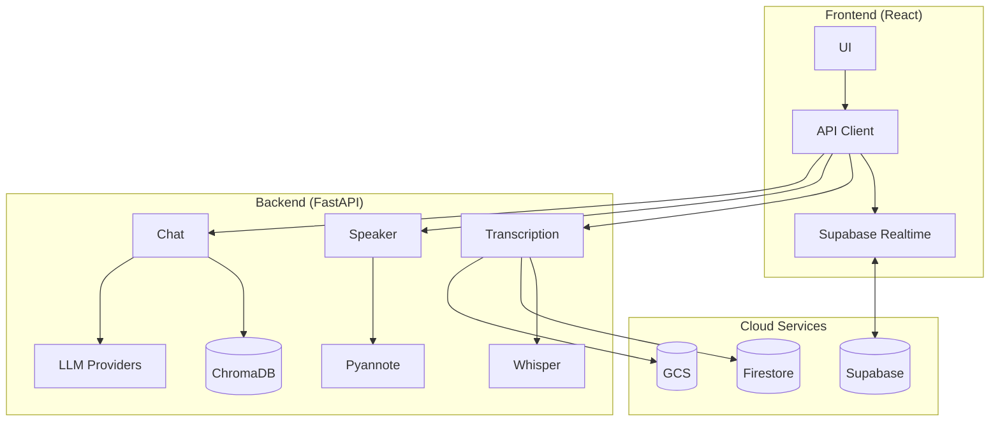

# AI Subtitles

Local-first AI video transcription with speaker diarization, semantic search, and RAG-powered chat.

## Features

- **Local AI Transcription** - Faster Whisper runs on your machine, no API costs
- **Speaker Diarization** - Automatically identifies and labels different speakers
- **Multi-format Support** - MP4, MP3, WAV, WebM, MKV, and more
- **Multi-language** - Auto-detection and translation using MarianMT
- **Semantic Search** - Find content by meaning with vector embeddings
- **Visual Search** - CLIP-powered search by describing what you see
- **Audio Analysis** - Detect laughter, applause, music, and emotions
- **RAG Chat** - Ask questions about your video with context-aware answers
- **Background Jobs** - Queue large files for async processing
- **Real-time Updates** - Live progress via Supabase
- **Share Links** - Generate public links to share results
- **Subtitle Export** - WebVTT and SRT with translation support
- **Multiple LLMs** - Ollama (local), Groq, OpenAI, Anthropic, Grok

## Tech Stack

| Layer | Technologies |
|-------|-------------|
| **Frontend** | React 19, TypeScript, Vite, TailwindCSS, React Query |
| **Backend** | FastAPI, Faster Whisper, PyTorch, Pyannote, ChromaDB |
| **Infrastructure** | Supabase, Google Cloud (Run, Storage, Firestore), Netlify |

## Quick Start

### Prerequisites

- Node.js 18+, Python 3.9+, FFmpeg
- [HuggingFace token](https://huggingface.co/settings/tokens) (for speaker diarization)

### Backend

```bash
cd backend
python -m venv venv && source venv/bin/activate
pip install -r requirements.txt
cp .env.example .env  # Edit with your settings
uvicorn main:app --reload --port 8000
```

### Frontend

```bash
cd frontend
npm install
npm run dev
```

Open http://localhost:5173

## Architecture



## Troubleshooting

| Issue | Solution |
|-------|----------|
| `No module named 'torch'` | Activate venv: `source venv/bin/activate` |
| `FFmpeg not found` | Install: `brew install ffmpeg` (macOS) or `apt install ffmpeg` |
| Speaker diarization fails | Check `HUGGINGFACE_TOKEN` and [accept pyannote terms](https://huggingface.co/pyannote/speaker-diarization) |
| Ollama connection error | Start Ollama: `ollama serve` |
| Large file upload fails | Enable GCS: `ENABLE_GCS_UPLOADS=true` |

## Documentation

- [Configuration Guide](docs/CONFIGURATION.md) - All environment variables
- [API Reference](docs/API.md) - Complete endpoint documentation
- [Architecture](docs/ARCHITECTURE.md) - Detailed system diagrams
- [Speaker Diarization Setup](docs/SPEAKER_DIARIZATION_SETUP.md)
- [Production Deployment](docs/PRODUCTION_DEPLOYMENT_FIXES.md)

## Project Structure

```
ai-subs/
├── frontend/          # React + TypeScript
│   ├── src/
│   │   ├── components/
│   │   ├── hooks/
│   │   ├── services/
│   │   └── types/
│   └── package.json
├── backend/           # FastAPI + ML
│   ├── routers/       # API endpoints
│   ├── services/      # Business logic
│   ├── models/        # Pydantic schemas
│   └── main.py
└── docs/              # Documentation
```

## Contributing

Contributions welcome! Please open issues or submit pull requests.

## Acknowledgments

[Faster Whisper](https://github.com/guillaumekln/faster-whisper) |
[Pyannote](https://github.com/pyannote/pyannote-audio) |
[ChromaDB](https://www.trychroma.com/) |
[Ollama](https://ollama.ai/) |
[CLIP](https://github.com/openai/CLIP) |
[PANNs](https://github.com/qiuqiangkong/audioset_tagging_cnn)
