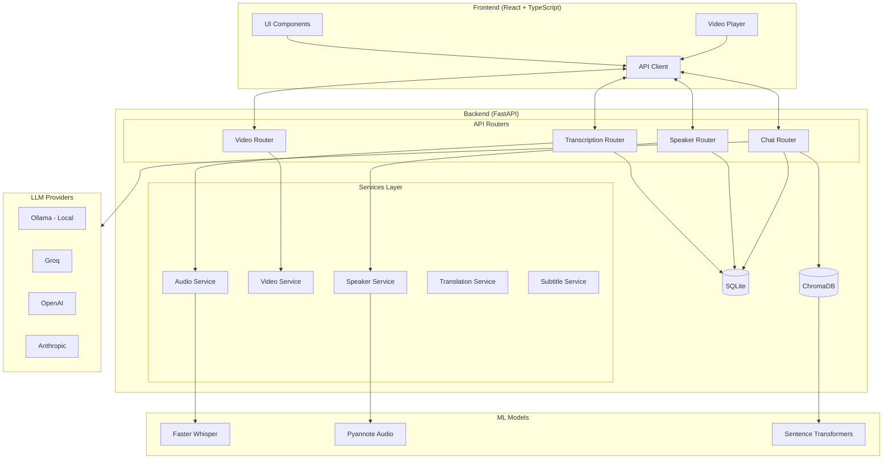
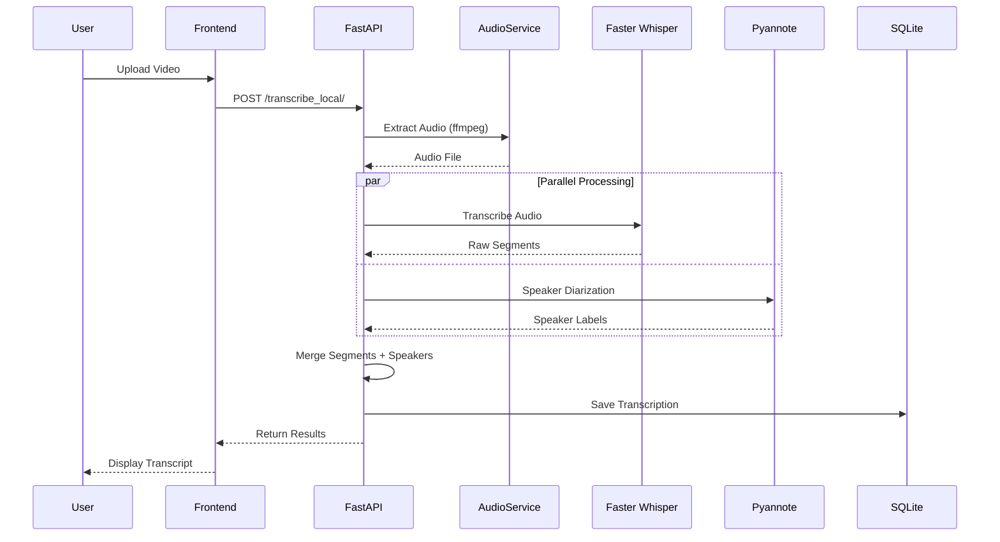
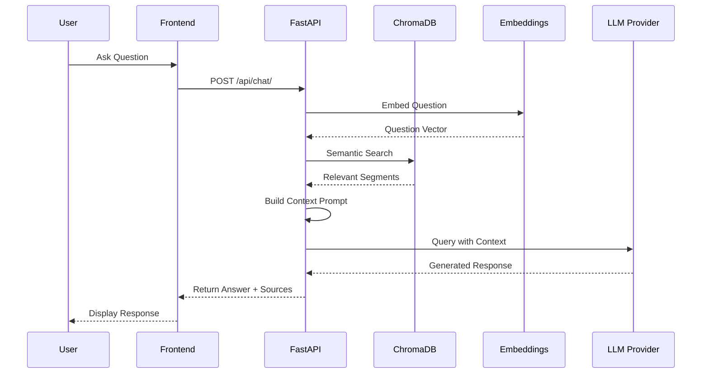
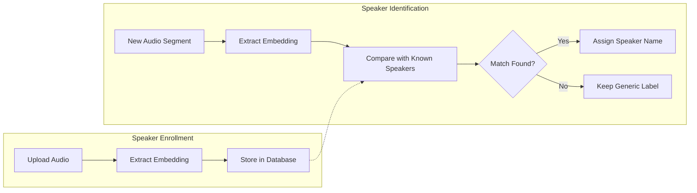

# AI Subtitles

A sophisticated full-stack AI-powered application for automatic video transcription, subtitle generation, and intelligent content analysis. Features local AI processing (no expensive API calls required), speaker identification, multi-language support, semantic search, and RAG-powered chat about your video content.

## Key Features

### Core Transcription
- **Local AI Transcription**: Uses Faster Whisper model - no OpenAI API key required
- **Multi-format Support**: MP4, MPEG, MPGA, M4A, WAV, WebM, MP3
- **Speaker Diarization**: Automatically identifies and labels different speakers with color coding
- **Precise Timestamps**: Every segment includes accurate start/end times
- **Multi-language Support**: Auto-detection and local translation using MarianMT

### Advanced Features
- **Semantic Search**: Vector-based search using ChromaDB embeddings to find content by meaning
- **RAG-Powered Chat**: Ask questions about your video content with context-aware responses
- **AI Summarization**: Generate summaries using local BART model
- **Subtitle Export**: Generate WebVTT and SRT subtitle files with translation support
- **Video Player Integration**: Synchronized playback with transcript navigation
- **Speaker Analytics**: Speaking time analysis and segment statistics

### Flexible LLM Support
Choose your preferred AI provider:
- **Ollama** (local, free) - recommended for privacy
- **Groq** (cloud, fast)
- **OpenAI** (GPT models)
- **Anthropic** (Claude models)

## Technology Stack

### Frontend
- **React** 19.0 with TypeScript
- **Vite** 6.1 (fast build tool with HMR)
- **TailwindCSS** 3.3 (utility-first styling)
- **React Query** (async state management)
- **FFmpeg** (browser-based video processing)
- **React Player** (video playback)

### Backend
- **FastAPI** (high-performance async Python framework)
- **Faster Whisper** (local speech-to-text)
- **PyTorch** + **TorchAudio** (ML framework)
- **Pyannote.audio** (speaker diarization)
- **ChromaDB** (vector database for semantic search)
- **Sentence Transformers** (embeddings)
- **MoviePy** (video processing)
- **SQLite3** (local database)

## Architecture

### System Overview



### Transcription Flow



### RAG Chat Flow



### Speaker Recognition Flow



## Prerequisites

- **Node.js** 18+ and npm
- **Python** 3.9+
- **FFmpeg** (system installation required)
- **HuggingFace Account** (for speaker diarization token)
- **Ollama** (optional, for local LLM) - [Install here](https://ollama.ai/)

## Quick Start

### 1. Clone the Repository

```bash
git clone <repository-url>
cd ai-subs
```

### 2. Backend Setup

```bash
cd backend

# Create virtual environment
python -m venv venv
source venv/bin/activate  # On Windows: venv\Scripts\activate

# Install dependencies
pip install -r requirements.txt

# Configure environment variables
cp .env.example .env
# Edit .env with your settings (see Configuration section below)

# Run the server
uvicorn main:app --reload --host 0.0.0.0 --port 8000
```

The API will be available at `http://localhost:8000`

### 3. Frontend Setup

```bash
cd frontend

# Install dependencies
npm install

# Run development server
npm run dev
```

The frontend will be available at `http://localhost:5173`

## Configuration

### Backend Environment Variables

Edit `backend/.env` with your configuration:

```bash
# HuggingFace Token (REQUIRED for speaker diarization)
# Get token: https://huggingface.co/settings/tokens
# Accept pyannote terms: https://huggingface.co/pyannote/speaker-diarization
HUGGINGFACE_TOKEN=your_token_here

# Whisper Model Settings
FASTWHISPER_MODEL=small          # Options: tiny, base, small, medium, large
FASTWHISPER_DEVICE=cpu           # Options: cpu, cuda, mps (Apple Silicon)
FASTWHISPER_COMPUTE_TYPE=int8    # Options: int8, float16, float32

# Speaker Diarization
ENABLE_SPEAKER_DIARIZATION=true
MIN_SPEAKERS=1
MAX_SPEAKERS=10

# LLM Provider (for chat/summarization)
DEFAULT_LLM_PROVIDER=local       # Options: local, groq, openai, anthropic

# Ollama Settings (if using local LLM)
OLLAMA_BASE_URL=http://localhost:11434
OLLAMA_MODEL=llama3.2:3b

# Cloud LLM API Keys (optional)
GROQ_API_KEY=your_groq_api_key
OPENAI_API_KEY=your_openai_api_key
ANTHROPIC_API_KEY=your_anthropic_api_key
```

### First-Time Setup

1. **Install Ollama** (optional, for local LLM):
   ```bash
   # Visit https://ollama.ai/ and install for your platform
   # Pull a model:
   ollama pull llama3.2:3b
   ```

2. **Get HuggingFace Token**:
   - Create account at https://huggingface.co
   - Generate token at https://huggingface.co/settings/tokens
   - Accept pyannote terms at https://huggingface.co/pyannote/speaker-diarization

3. **First Run**: Backend will download required models automatically (~500MB-2GB depending on configuration)

## Usage

1. **Upload Video**: Drag and drop or click to upload audio/video file
2. **Configure Options**:
   - Select language (or auto-detect)
   - Enable speaker diarization
   - Choose translation language
3. **Process**: Click "Transcribe" and wait for processing
4. **Explore Results**:
   - View transcript with speaker labels
   - Search semantically or by keywords
   - Ask questions about the content
   - Generate AI summaries
   - Export subtitles in multiple formats
5. **Save**: Transcriptions are saved locally for future access

## Project Structure

```
ai-subs/
├── frontend/                    # React + TypeScript frontend
│   ├── src/
│   │   ├── components/          # UI components
│   │   ├── hooks/               # Custom React hooks
│   │   ├── services/            # API client
│   │   └── utils/               # Helper functions
│   └── package.json
├── backend/                     # FastAPI Python backend
│   ├── main.py                  # FastAPI app entry point & router registration
│   ├── config.py                # Pydantic settings configuration
│   ├── database.py              # SQLite operations
│   ├── dependencies.py          # Dependency injection for ML models
│   ├── routers/                 # API endpoint organization
│   │   ├── transcription.py     # Transcription endpoints
│   │   ├── speaker.py           # Speaker recognition endpoints
│   │   ├── chat.py              # LLM/RAG chat endpoints
│   │   └── video.py             # Video serving & utilities
│   ├── models/                  # Pydantic request/response models
│   │   ├── common.py            # Shared models (ErrorResponse, etc.)
│   │   ├── transcription.py     # Transcription models
│   │   ├── speaker.py           # Speaker models
│   │   ├── chat.py              # Chat/LLM models
│   │   └── video.py             # Video utility models
│   ├── services/                # Business logic layer
│   │   ├── audio_service.py     # Audio extraction & processing
│   │   ├── video_service.py     # Video operations & screenshots
│   │   ├── speaker_service.py   # Speaker diarization logic
│   │   ├── translation_service.py
│   │   ├── subtitle_service.py  # SRT/VTT generation
│   │   └── summarization_service.py
│   ├── utils/                   # Helper utilities
│   │   ├── file_utils.py        # File hashing
│   │   └── time_utils.py        # Timestamp formatting
│   ├── speaker_diarization.py   # Pyannote.audio integration
│   ├── speaker_recognition.py   # Voice biometric system
│   ├── llm_providers.py         # LLM provider abstraction
│   ├── vector_store.py          # ChromaDB wrapper for RAG
│   └── requirements.txt
├── docs/                        # Additional documentation
└── README.md                    # This file
```

## Documentation

- **[Frontend Setup](frontend/README.md)** - Detailed frontend installation and development guide
- **[Frontend Architecture](frontend/ARCHITECTURE.md)** - Component structure and patterns
- **[Backend Setup](backend/README.md)** - Backend installation and API documentation
- **[Deployment Guide](docs/DEPLOYMENT.md)** - Production deployment instructions
- **[AWS Deployment](docs/AWS_DEPLOYMENT.md)** - AWS-specific deployment guide
- **[Speaker Diarization Setup](docs/SPEAKER_DIARIZATION_SETUP.md)** - Detailed speaker identification guide

## API Endpoints

### Transcription
- `POST /transcribe_local/` - Local transcription using Faster Whisper
- `POST /transcribe_local_stream/` - Streaming transcription
- `GET /transcriptions/` - List all saved transcriptions
- `GET /transcription/{video_hash}` - Get specific transcription

### Translation & Subtitles
- `POST /translate_local/` - Translate segments locally
- `GET /subtitles/{language}` - Generate subtitle file

### Search & Chat
- `POST /api/index_video/` - Index video for semantic search
- `POST /api/chat/` - Chat with video content (RAG)

### Summaries
- `POST /generate_summary/` - Generate AI summary

See [Backend README](backend/README.md) for complete API documentation.

## Development

### Frontend Development
```bash
cd frontend
npm run dev          # Start dev server with hot reload
npm run build        # Build for production
npm run lint         # Run ESLint
npm run preview      # Preview production build
```

### Backend Development
```bash
cd backend
uvicorn main:app --reload  # Run with auto-reload
```

## Performance & Privacy

- **Local-First**: Core transcription runs entirely on your machine
- **No API Costs**: Use Ollama for completely free local processing
- **Fast Processing**: Optimized for speed with quantized models
- **Data Privacy**: Transcriptions stored locally in SQLite database
- **Flexible Deployment**: Run fully local or use cloud LLMs as needed

## Troubleshooting

### Common Issues

**"No module named 'torch'"**
- Ensure you're in the virtual environment: `source venv/bin/activate`

**"FFmpeg not found"**
- Install FFmpeg: `brew install ffmpeg` (macOS) or `apt-get install ffmpeg` (Linux)

**Speaker diarization not working**
- Verify HUGGINGFACE_TOKEN is set correctly
- Ensure you accepted pyannote terms of use

**Ollama connection error**
- Start Ollama: `ollama serve`
- Verify it's running: `curl http://localhost:11434`

## Contributing

Contributions are welcome! Please feel free to submit pull requests or open issues for bugs and feature requests.

## License

[Add your license here]

## Acknowledgments

- [Faster Whisper](https://github.com/guillaumekln/faster-whisper) - Fast speech recognition
- [Pyannote.audio](https://github.com/pyannote/pyannote-audio) - Speaker diarization
- [ChromaDB](https://www.trychroma.com/) - Vector database
- [Ollama](https://ollama.ai/) - Local LLM runtime
