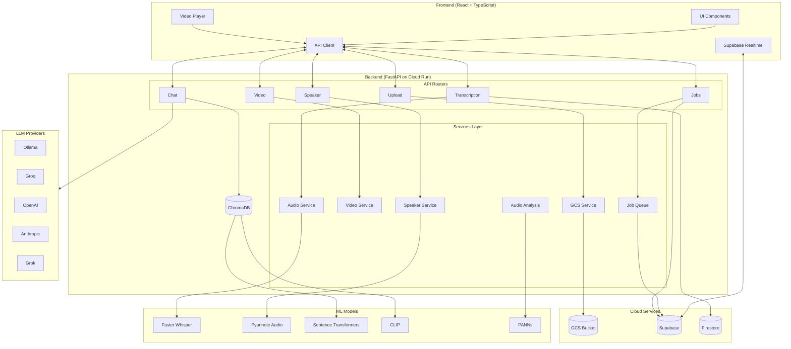
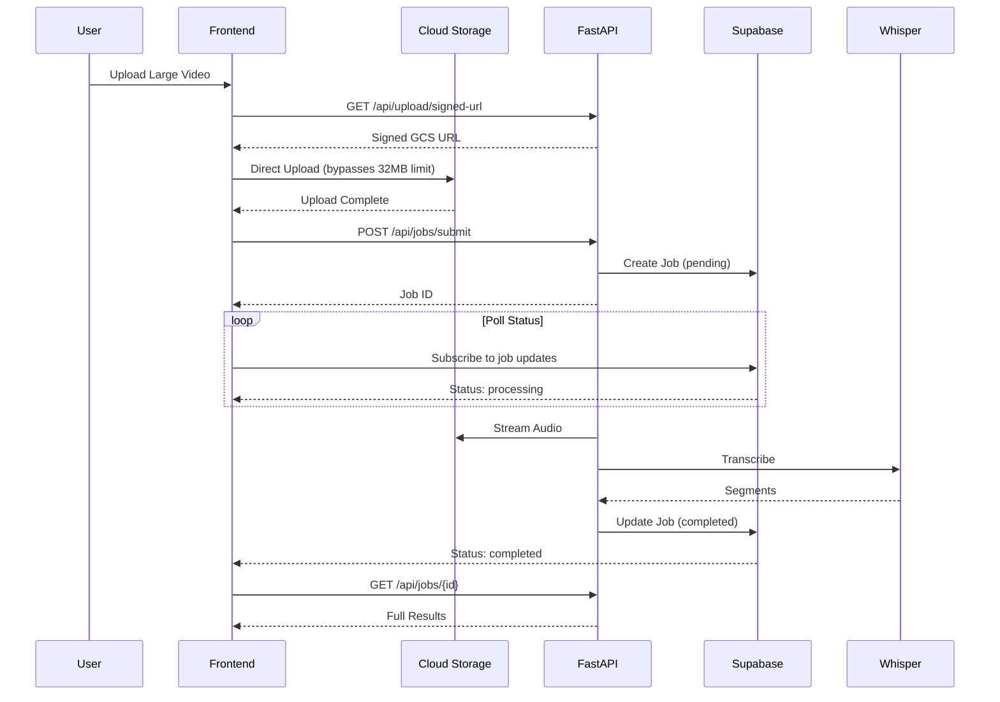
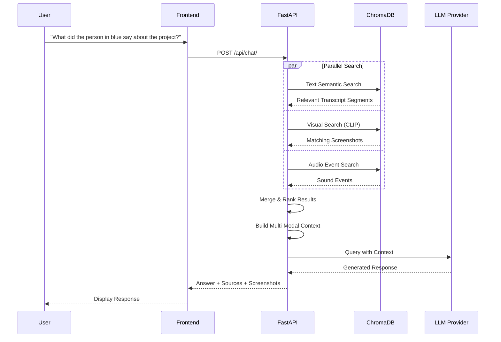
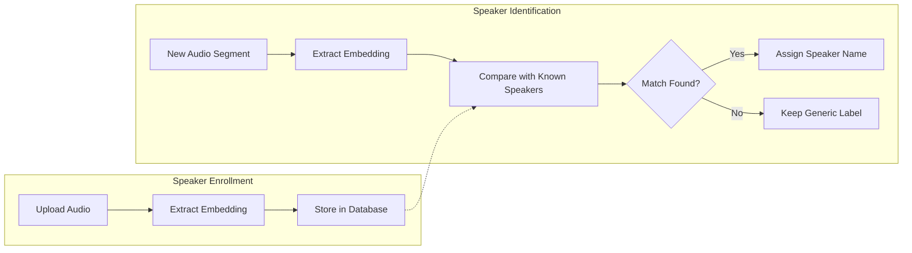

# AI Subtitles

A sophisticated full-stack AI-powered application for automatic video transcription, subtitle generation, and intelligent content analysis. Features local AI processing (no expensive API calls required), speaker identification, multi-language support, semantic search, visual search, audio analysis, and RAG-powered chat about your video content.

## Key Features

### Core Transcription

- **Local AI Transcription**: Uses Faster Whisper model - no OpenAI API key required
- **Multi-format Support**: MP4, MPEG, MPGA, M4A, WAV, WebM, MP3, MKV (auto-converted)
- **Speaker Diarization**: Automatically identifies and labels different speakers with color coding
- **Precise Timestamps**: Every segment includes accurate start/end times
- **Multi-language Support**: Auto-detection and local translation using MarianMT

### Background Job Processing

- **Async Processing**: Submit large files for background transcription
- **Job Queue**: Supabase-powered job management with status tracking
- **Real-time Updates**: Live progress updates via Supabase real-time
- **Share Links**: Generate public links to share transcription results
- **Large File Support**: Direct-to-cloud uploads bypass Cloud Run limits

### Advanced Search & Analysis

- **Semantic Search**: Vector-based search using ChromaDB embeddings to find content by meaning
- **Visual Search**: CLIP-powered screenshot search - find moments by describing what you see
- **Audio Analysis**: PANNs model detects laughter, applause, music, and other sound events
- **Speech Emotion**: Detect emotional tone (happy, sad, angry, neutral) in speech segments
- **RAG-Powered Chat**: Ask questions about your video content with context-aware responses

### AI Features

- **AI Summarization**: Generate summaries using local BART model or cloud LLMs
- **Multi-modal RAG**: Combines text, images, and audio context for richer answers
- **Subtitle Export**: Generate WebVTT and SRT subtitle files with translation support
- **Video Player Integration**: Synchronized playback with transcript navigation
- **Speaker Analytics**: Speaking time analysis and segment statistics

### Flexible LLM Support

Choose your preferred AI provider:

- **Ollama** (local, free) - recommended for privacy
- **Groq** (cloud, fast)
- **OpenAI** (GPT models)
- **Anthropic** (Claude models)
- **Grok** (xAI)

## Technology Stack

### Frontend

- **React** 19.0 with TypeScript
- **Vite** 6.1 (fast build tool with HMR)
- **TailwindCSS** 3.3 (utility-first styling)
- **React Query** (async state management)
- **Supabase Client** (real-time job updates)
- **FFmpeg.wasm** (browser-based video processing)
- **React Player** (video playback)

### Backend

- **FastAPI** (high-performance async Python framework)
- **Faster Whisper** (local speech-to-text)
- **PyTorch** + **TorchAudio** (ML framework)
- **Pyannote.audio** (speaker diarization)
- **ChromaDB** (vector database for semantic search)
- **Sentence Transformers** (text embeddings)
- **CLIP** (visual embeddings for image search)
- **PANNs** (audio event detection)
- **MoviePy** (video processing)

### Infrastructure

- **Supabase** (job queue and real-time updates)
- **Google Cloud Storage** (video file storage)
- **Google Cloud Run** (backend deployment)
- **Firestore** (production database)
- **SQLite** (local development database)
- **Netlify** (frontend deployment)

## Architecture

### System Overview



### Background Job Flow



### Multi-Modal RAG Chat



### Speaker Recognition Flow



### Deployment Stack

- **Frontend**: Netlify (automatic deploys from main branch)
- **Backend**: Google Cloud Run (containerized FastAPI)
- **Database**: Firestore (transcription metadata)
- **Job Queue**: Supabase (background processing)
- **Storage**: Google Cloud Storage (video files)

## Prerequisites

### For Local Development

- **Node.js** 18+ and npm
- **Python** 3.9+
- **FFmpeg** (system installation required)
- **HuggingFace Account** (for speaker diarization token)
- **Ollama** (optional, for local LLM) - [Install here](https://ollama.ai/)

### For Production Features

- **Supabase Account** (for background job processing)
- **Google Cloud Project** (for Cloud Run, GCS, Firestore)
- **Netlify Account** (for frontend hosting)

## Quick Start

### 1. Clone the Repository

```bash
git clone <repository-url>
cd ai-subs
```

### 2. Backend Setup

```bash
cd backend

# Create virtual environment
python -m venv venv
source venv/bin/activate  # On Windows: venv\Scripts\activate

# Install dependencies
pip install -r requirements.txt

# Configure environment variables
cp .env.example .env
# Edit .env with your settings (see Configuration section below)

# Run the server
uvicorn main:app --reload --host 0.0.0.0 --port 8000
```

The API will be available at `http://localhost:8000`

### 3. Frontend Setup

```bash
cd frontend

# Install dependencies
npm install

# Run development server
npm run dev
```

The frontend will be available at `http://localhost:5173`

## Configuration

### Backend Environment Variables

Edit `backend/.env` with your configuration:

```bash
# ===================
# Core Settings
# ===================
API_TITLE=AI Subtitles API
API_VERSION=1.0.0
CORS_ORIGINS=["http://localhost:5173","https://REDACTED_FRONTEND_URL"]

# ===================
# Database Configuration
# ===================
# Local development: sqlite
# Production: firestore
DATABASE_TYPE=sqlite
DATABASE_PATH=transcriptions.db
FIRESTORE_COLLECTION=transcriptions

# ===================
# Whisper Model Settings
# ===================
FASTWHISPER_MODEL=small          # Options: tiny, base, small, medium, large
FASTWHISPER_DEVICE=cpu           # Options: cpu, cuda, mps (Apple Silicon)
FASTWHISPER_COMPUTE_TYPE=int8    # Options: int8, float16, float32

# ===================
# Speaker Diarization
# ===================
# Get token: https://huggingface.co/settings/tokens
# Accept terms: https://huggingface.co/pyannote/speaker-diarization
HUGGINGFACE_TOKEN=your_token_here
ENABLE_SPEAKER_DIARIZATION=true
MIN_SPEAKERS=1
MAX_SPEAKERS=10

# ===================
# LLM Providers
# ===================
DEFAULT_LLM_PROVIDER=local       # Options: local, groq, openai, anthropic, grok

# Ollama (local)
OLLAMA_BASE_URL=http://localhost:11434
OLLAMA_MODEL=llama3.2:3b

# Cloud LLM API Keys
GROQ_API_KEY=your_groq_api_key
OPENAI_API_KEY=your_openai_api_key
ANTHROPIC_API_KEY=your_anthropic_api_key
XAI_API_KEY=your_xai_api_key

# ===================
# Visual Search (CLIP)
# ===================
ENABLE_VISUAL_SEARCH=true
CLIP_MODEL=ViT-B/32

# ===================
# Audio Analysis
# ===================
ENABLE_AUDIO_ANALYSIS=true
PANNS_MODEL=Cnn14_mAP=0.431.pth
AUDIO_EVENT_THRESHOLD=0.3
ENABLE_SPEECH_EMOTION=true

# VAD Settings
VAD_ENABLED=true
VAD_THRESHOLD=0.5
VAD_MIN_SILENCE_DURATION_MS=300

# ===================
# Cloud Storage (GCS)
# ===================
ENABLE_GCS_UPLOADS=false         # Set true for production
GCS_BUCKET_NAME=your-bucket-name
GCS_VIDEO_PREFIX=videos/
GCS_AUDIO_PREFIX=audio/
GCS_URL_EXPIRY=3600

# ===================
# Supabase (Job Queue)
# ===================
SUPABASE_URL=https://your-project.supabase.co
SUPABASE_SERVICE_KEY=your_service_key

# ===================
# Vector Database
# ===================
CHROMA_DB_PATH=./chroma_db
```

### Frontend Environment Variables

Edit `frontend/.env`:

```bash
VITE_API_URL=http://localhost:8000

# Supabase (for real-time job updates)
VITE_SUPABASE_URL=https://your-project.supabase.co
VITE_SUPABASE_ANON_KEY=your_anon_key
```

### First-Time Setup

1. **Install Ollama** (optional, for local LLM):

   ```bash
   # Visit https://ollama.ai/ and install for your platform
   # Pull a model:
   ollama pull llama3.2:3b
   ```

2. **Get HuggingFace Token**:

   - Create account at https://huggingface.co
   - Generate token at https://huggingface.co/settings/tokens
   - Accept pyannote terms at https://huggingface.co/pyannote/speaker-diarization

3. **First Run**: Backend will download required models automatically (~500MB-2GB depending on configuration)

## Usage

1. **Upload Video**: Drag and drop or click to upload audio/video file
2. **Configure Options**:
   - Select language (or auto-detect)
   - Enable speaker diarization
   - Choose processing mode (streaming or background)
3. **Process**: Click "Transcribe" and monitor progress
4. **Explore Results**:
   - View transcript with speaker labels and colors
   - Search semantically or by keywords
   - Use visual search to find moments by description
   - Ask questions about the content
   - Generate AI summaries
   - Export subtitles in multiple formats
5. **Share**: Generate share links for background job results

## Project Structure

```
ai-subs/
├── frontend/                    # React + TypeScript frontend
│   ├── src/
│   │   ├── components/
│   │   │   ├── features/        # Feature components
│   │   │   │   ├── transcription/
│   │   │   │   ├── chat/
│   │   │   │   ├── search/
│   │   │   │   ├── jobs/        # Job management UI
│   │   │   │   └── speakers/
│   │   │   └── common/
│   │   ├── hooks/               # Custom React hooks
│   │   │   ├── useJobTracker.ts
│   │   │   ├── useSupabaseRealtime.ts
│   │   │   └── ...
│   │   ├── services/
│   │   │   ├── api.ts           # API client
│   │   │   └── gcsUpload.ts     # Direct GCS uploads
│   │   ├── lib/
│   │   │   └── supabase.ts      # Supabase client
│   │   └── types/
│   └── package.json
├── backend/                     # FastAPI Python backend
│   ├── main.py                  # FastAPI app entry point
│   ├── config.py                # Pydantic settings
│   ├── database.py              # SQLite/Firestore abstraction
│   ├── dependencies.py          # ML model dependency injection
│   ├── routers/
│   │   ├── transcription.py     # Transcription endpoints
│   │   ├── speaker.py           # Speaker recognition
│   │   ├── chat.py              # LLM/RAG chat + visual search
│   │   ├── video.py             # Video serving
│   │   ├── upload.py            # GCS signed URL generation
│   │   └── jobs.py              # Background job management
│   ├── services/
│   │   ├── audio_service.py     # Audio extraction
│   │   ├── video_service.py     # Video processing
│   │   ├── speaker_service.py   # Speaker diarization
│   │   ├── translation_service.py
│   │   ├── subtitle_service.py
│   │   ├── summarization_service.py
│   │   ├── audio_analysis_service.py  # PANNs + emotion
│   │   ├── gcs_service.py       # Cloud Storage
│   │   ├── job_queue_service.py # Supabase job queue
│   │   └── supabase_service.py  # Supabase client
│   ├── models/                  # Pydantic schemas
│   │   ├── transcription.py
│   │   ├── chat.py
│   │   ├── speaker.py
│   │   ├── audio_events.py
│   │   └── video.py
│   ├── llm_providers.py         # LLM abstraction (5 providers)
│   ├── vector_store.py          # ChromaDB wrapper
│   ├── audio_analyzer.py        # PANNs integration
│   ├── speaker_diarization.py   # Pyannote integration
│   ├── speaker_recognition.py   # Voice biometrics
│   ├── Dockerfile               # Cloud Run deployment
│   └── requirements.txt
├── docs/
│   ├── SPEAKER_DIARIZATION_SETUP.md
│   └── PRODUCTION_DEPLOYMENT_FIXES.md
└── README.md
```

## Documentation

- **[Frontend Setup](frontend/README.md)** - Detailed frontend installation and development guide
- **[Frontend Architecture](frontend/ARCHITECTURE.md)** - Component structure and patterns
- **[Backend Setup](backend/README.md)** - Backend installation and API documentation
- **[Production Deployment](docs/PRODUCTION_DEPLOYMENT_FIXES.md)** - Cloud Run + Netlify deployment
- **[Speaker Diarization Setup](docs/SPEAKER_DIARIZATION_SETUP.md)** - Detailed speaker identification guide

## API Endpoints

### Transcription

- `POST /transcribe_local/` - Local transcription using Faster Whisper
- `POST /transcribe_local_stream/` - Streaming transcription with SSE
- `POST /transcribe_gcs_stream/` - Transcribe from GCS signed URL
- `GET /transcriptions/` - List all saved transcriptions
- `GET /transcription/{video_hash}` - Get specific transcription
- `DELETE /transcription/{video_hash}` - Delete transcription

### Upload & Jobs

- `POST /api/upload/signed-url` - Get signed URL for GCS upload
- `POST /api/upload/resumable-url` - Get resumable upload URL
- `POST /api/jobs/submit` - Submit background transcription job
- `GET /api/jobs/{job_id}` - Get job status and results
- `GET /api/jobs` - List all jobs
- `DELETE /api/jobs/{job_id}` - Cancel job
- `GET /api/jobs/{job_id}/share` - Generate share link

### Search & Chat

- `POST /api/index_video/` - Index video for semantic search
- `POST /api/index_images/` - Index screenshots with CLIP
- `POST /api/search_images/` - Visual search by description
- `POST /api/chat/` - Multi-modal RAG chat

### Speaker Recognition

- `POST /api/speaker/enroll` - Enroll speaker voice sample
- `GET /api/speaker/list` - List enrolled speakers
- `POST /api/speaker/identify` - Identify speaker from audio
- `POST /api/speaker/transcription/{video_hash}/auto_identify_speakers` - Auto-identify

### Utilities

- `GET /video/{video_hash}` - Stream video with range support
- `GET /subtitles/{language}` - Generate SRT subtitles
- `POST /translate_local/` - Translate segments
- `POST /generate_summary/` - Generate AI summary

See [Backend README](backend/README.md) for complete API documentation.

## Development

### Frontend Development

```bash
cd frontend
npm run dev          # Start dev server with hot reload
npm run build        # Build for production
npm run lint         # Run ESLint
npm run preview      # Preview production build
```

### Backend Development

```bash
cd backend
uvicorn main:app --reload  # Run with auto-reload
```

## Performance & Privacy

- **Local-First**: Core transcription runs entirely on your machine
- **No API Costs**: Use Ollama for completely free local processing
- **Fast Processing**: Optimized for speed with quantized models
- **Flexible Storage**: SQLite locally, Firestore/Supabase in production
- **Large File Support**: Direct GCS uploads bypass server limits
- **Background Processing**: Submit jobs and get notified when complete

## Troubleshooting

### Common Issues

**"No module named 'torch'"**

- Ensure you're in the virtual environment: `source venv/bin/activate`

**"FFmpeg not found"**

- Install FFmpeg: `brew install ffmpeg` (macOS) or `apt-get install ffmpeg` (Linux)

**Speaker diarization not working**

- Verify HUGGINGFACE_TOKEN is set correctly
- Ensure you accepted pyannote terms of use

**Ollama connection error**

- Start Ollama: `ollama serve`
- Verify it's running: `curl http://localhost:11434`

**Large file upload fails**

- Enable GCS uploads: `ENABLE_GCS_UPLOADS=true`
- Configure GCS bucket and credentials

**Background jobs not updating**

- Check Supabase credentials
- Verify real-time is enabled in Supabase dashboard

## Contributing

Contributions are welcome! Please feel free to submit pull requests or open issues for bugs and feature requests.

## License

[Add your license here]

## Acknowledgments

- [Faster Whisper](https://github.com/guillaumekln/faster-whisper) - Fast speech recognition
- [Pyannote.audio](https://github.com/pyannote/pyannote-audio) - Speaker diarization
- [ChromaDB](https://www.trychroma.com/) - Vector database
- [Ollama](https://ollama.ai/) - Local LLM runtime
- [CLIP](https://github.com/openai/CLIP) - Visual embeddings
- [PANNs](https://github.com/qiuqiangkong/audioset_tagging_cnn) - Audio event detection
- [Supabase](https://supabase.com/) - Backend as a service
