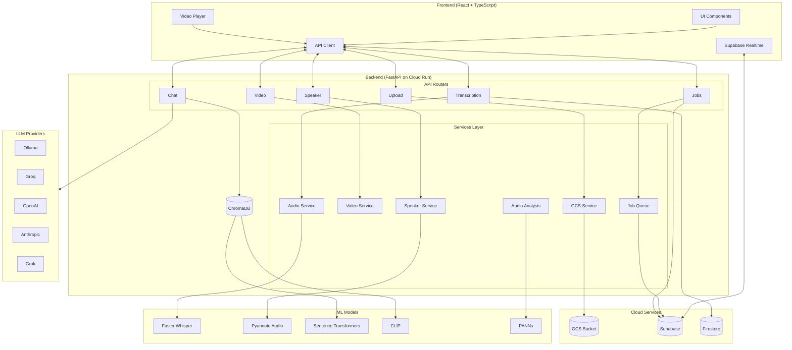
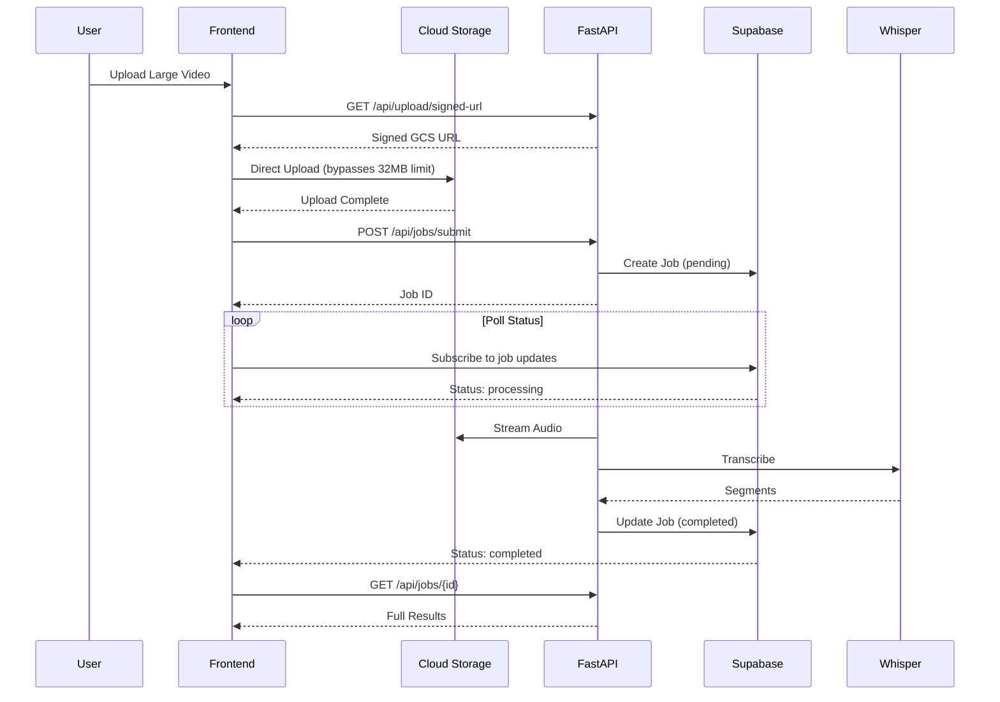
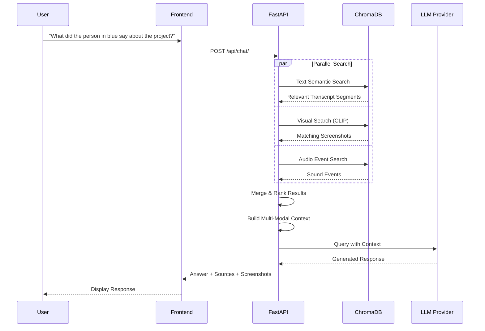
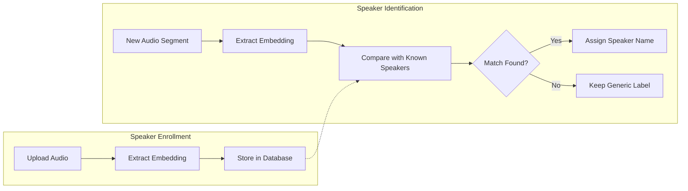

# Architecture

Detailed architecture documentation for AI-Subs.

## System Overview

## Background Job Flow

How large files are processed asynchronously:

## Multi-Modal RAG Chat

How the chat system combines text, images, and audio for context-aware answers:

## Speaker Recognition Flow

How speakers are enrolled and identified:

## Deployment Stack

| Component | Service | Purpose |
|-----------|---------|---------|
| Frontend | Netlify | Automatic deploys from main branch |
| Backend | Google Cloud Run | Containerized FastAPI with GPU |
| Database | Firestore | Transcription metadata storage |
| Job Queue | Supabase | Background processing & real-time |
| Storage | Google Cloud Storage | Video and screenshot files |
| Vector DB | ChromaDB | Semantic search embeddings |

## Data Flow

### Transcription Flow

1. **Upload**: File uploaded directly to GCS via signed URL
2. **Job Creation**: Supabase record created with `pending` status
3. **Processing**: Backend streams audio from GCS, runs Whisper
4. **Diarization**: Pyannote identifies speakers (if enabled)
5. **Storage**: Results saved to Firestore, job updated in Supabase
6. **Notification**: Real-time update sent to frontend via Supabase

### Search Indexing Flow

1. **Text**: Transcript segments embedded with Sentence Transformers → ChromaDB
2. **Visual**: Screenshots extracted with MoviePy → CLIP embeddings → ChromaDB
3. **Audio**: PANNs analyzes audio events → Stored with timestamps

### Chat Query Flow

1. **Query**: User question received
2. **Search**: Parallel search across text, visual, and audio indices
3. **Context**: Top results merged and ranked
4. **Generation**: LLM generates response with context
5. **Response**: Answer returned with source references
